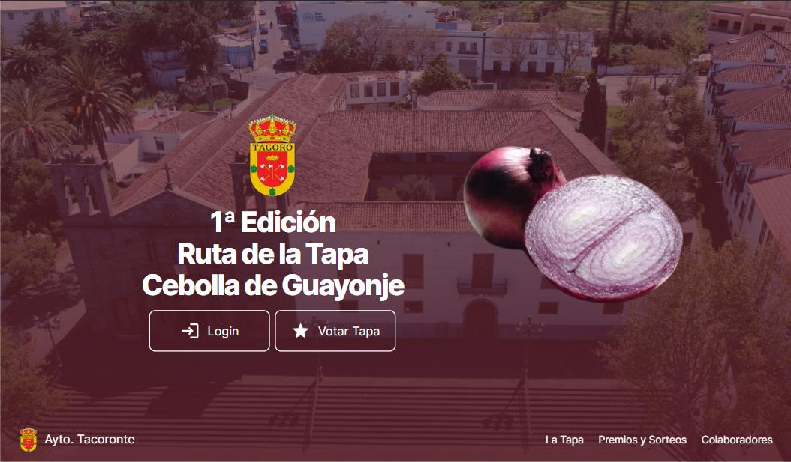

# Eventhias Landing Page <picture><source media="(prefers-color-scheme: dark)" srcset="https://eventhias.com/logo-eventhias.png"><source media="(prefers-color-scheme: light)" srcset="https://eventhias.com/logo-eventhias.png"></picture>

> An Astro + Tailwind CSS template for landing pages created by Eventhias.com.

## Features

- 💨 Tailwind CSS for styling
- 🎨 Themeable
  - CSS variables are defined in `src/styles/theme.css` and mapped to Tailwind classes (`tailwind.config.cjs`)
- 🌙 Dark mode
- 📱 Responsive (layout, images, typography)
- ♿ Accessible (as measured by https://web.dev/measure/)
- 🔎 SEO-enabled (as measured by https://web.dev/measure/)
- 🔗 Open Graph tags for social media sharing
- 💅 [Prettier](https://prettier.io/) setup for both [Astro](https://github.com/withastro/prettier-plugin-astro) and [Tailwind](https://github.com/tailwindlabs/prettier-plugin-tailwindcss)

## Commands

| Command                | Action                                            |
| :--------------------- | :------------------------------------------------ |
| `npm install`          | Install dependencies                              |
| `npm run dev`          | Start local dev server at `localhost:4321`        |
| `npm run build`        | Build your production site to `./dist/`           |
| `npm run preview`      | Preview your build locally, before deploying      |
| `npm run astro ...`    | Run CLI commands like `astro add`, `astro check`  |
| `npm run astro --help` | Get help using the Astro CLI                      |
| `npm run format`       | Format code with [Prettier](https://prettier.io/) |
| `npm run clean`        | Remove `node_modules` and build output            |

## Build and deploy

- npm run build
- open dist folder
- move image dist/tacoronte_bg.DLFsZTo3.jpg into _astro folder
- search /_astro throughout the project
- replace it with /ruta-de-la-tapa-tacoronte/_astro
- search /social.jpg in index.html
- replace it with /ruta-de-la-tapa-tacoronte/social.jpg
- adds the contents of the dist folder to the web host 